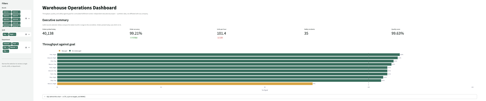
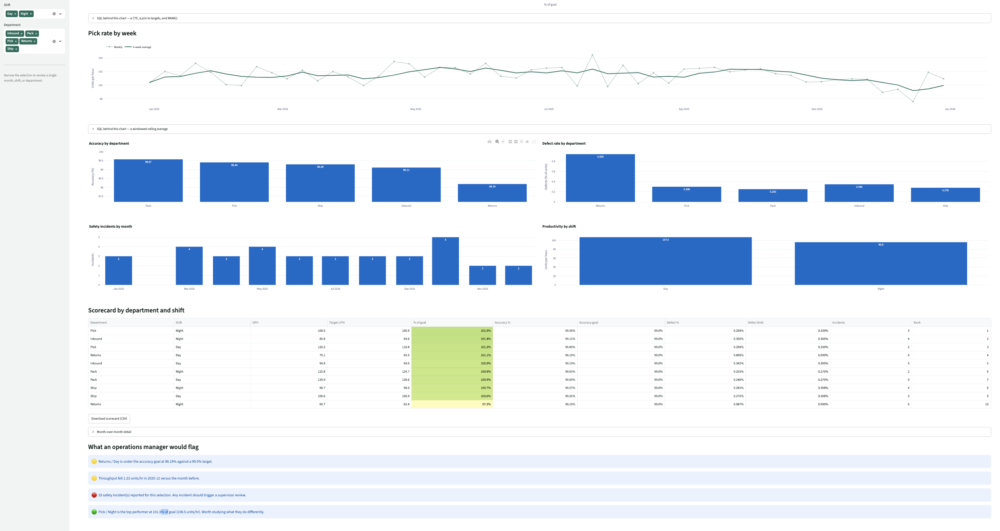

# Warehouse Operations Dashboard

[](https://github.com/imanimdavisb/warehouse-ops-dashboard/actions/workflows/ci.yml)


A SQL dashboard that measures a fulfillment center against its operational
goals — and surfaces where it is missing them.

Built with SQL (SQLite), Python, Streamlit, pandas, and Plotly on 3,650
simulated daily records across five departments and two shifts.

> Independent educational project built on synthetic data. Not affiliated with
> or endorsed by any company.
>
> **[Live demo](https://warehouse-ops-dashboard-imanimdavisb.streamlit.app/)** · [Screenshots](#screenshots)

## The finding

Every department in this facility runs between 94% and 96% of its throughput
goal — except one.

**Returns on night shift hits 91.7% of goal across the year.** Filter to
November and December and it falls to **76.9%**, while its defect rate climbs to
roughly three times the rate of any other group. Peak season volume arrives, and
the smallest, slowest team absorbs it without added support.

That is the kind of gap a weekly average hides and a target-relative view makes
obvious. The dashboard is built to make it obvious.

## Screenshots

| Attainment against goal | Scorecard |
| --- | --- |
|  |  |

## What it does

**Throughput against goal** — every department/shift pair as a percentage of its
own target, color-coded behind / near / at goal, with a reference line at 100%.
Ranking groups against their own goals rather than against each other keeps a
naturally slow department like Returns from looking like a failure by default.

**Month-over-month deltas** — accuracy and units per hour on the summary metrics
show the change from the prior month, not just a static number.

**Rolling 4-week trend** — the weekly pick rate plotted against its own 4-week
average, so a genuine decline separates from ordinary week-to-week noise.

**Scorecard** — actuals beside goals for throughput, accuracy, and defect rate,
with an attainment rank and a color gradient on percent-to-goal.

**Automated callouts** — the largest attainment gap, any group under the accuracy
goal, any group over the defect ceiling, the direction of the latest month, and
every safety incident. Generated from the same query results the charts use.

**Visible SQL** — expandable panels show the exact query behind each chart, with
the current filter values inlined.

## SQL demonstrated

| Technique | Where |
| --- | --- |
| `JOIN` across a fact and dimension table | Actuals joined to `department_targets` |
| CTEs (`WITH`) | Aggregate first, then compare to goal |
| `LAG()` | Month-over-month change without a self-join |
| `AVG() OVER (ROWS BETWEEN 3 PRECEDING ...)` | Rolling 4-week average |
| `RANK() OVER (ORDER BY ...)` | Attainment ranking |
| `NULLIF` | Guards every division |
| `CASE WHEN` | Date-scoped conditional aggregation |
| Parameterised dynamic filtering | `build_filter_clause` |

## Data model

```text
warehouse_performance (fact)        department_targets (dimension)
─────────────────────────────       ──────────────────────────────
work_date, week_start, month        department, shift
shift, department                   target_uph
orders_picked, accurate_orders      target_accuracy_pct
units_picked, labor_hours           max_defect_rate_pct
quality_defects, safety_incidents
```

One row per date, department, and shift, joined to the goal that group is held
to. Schema and indexes in [`sql/schema.sql`](sql/schema.sql).

## KPI definitions

| KPI | Definition |
| --- | --- |
| Units per hour (UPH) | Units picked ÷ labor hours |
| % of goal | UPH ÷ that group's target UPH |
| Order accuracy | Accurate orders ÷ total orders |
| Defect rate | Quality defects ÷ units picked |
| Quality score | 100% − defect rate |
| Pick rate | UPH aggregated by week |

## Design notes

**Filters are parameterised, not concatenated.** `build_filter_clause` returns a
clause containing only `?` placeholders plus a separate list of values, so
selected values are always bound by SQLite. It takes an optional table alias for
the queries that join a second table.

**SQL and business rules are separated from the UI.** `app.py` is presentation
only. That split is what makes 33 tests possible without launching Streamlit —
every query runs against a real in-memory SQLite database in CI, and every
insight threshold is tested at its boundary.

**Empty and NULL results are handled.** A filter combination matching no rows
returns NULL from every aggregate; the app checks the row count first and
formats missing values as `—` rather than raising.

**Data is seeded.** `generate_data.py` uses a fixed seed, so every clone
produces identical numbers and the screenshots stay accurate.

## Project structure

```text
warehouse-ops-dashboard/
├── app.py                     # Streamlit UI
├── generate_data.py           # Seeded synthetic dataset
├── setup_database.py          # Loads CSVs into SQLite
├── warehouse/
│   ├── queries.py             # SQL templates + filter builder
│   ├── insights.py            # Insight rules (pure functions)
│   ├── db.py                  # Connection + cached query helper
│   └── formatting.py          # NULL-safe formatters
├── tests/                     # 33 tests
├── sql/schema.sql
├── data/                      # Generated CSVs
└── .github/workflows/ci.yml   # Lint, test, rebuild on every push
```

## Run it

```bash
git clone https://github.com/imanimdavisb/warehouse-ops-dashboard.git
cd warehouse-ops-dashboard

python3 -m venv .venv
source .venv/bin/activate        # Windows: .venv\Scripts\activate
pip install -r requirements.txt

streamlit run app.py             # builds the database on first run
```

To rebuild the data explicitly:

```bash
python generate_data.py
python setup_database.py
```

## Run the tests

```bash
pip install -r requirements-dev.txt
pytest -q
ruff check .
```

## Roadmap

- [ ] Labor cost and overtime analysis against budget
- [ ] Anomaly detection on daily UPH rather than fixed thresholds
- [ ] Anonymised associate-level view
- [ ] Deploy to Streamlit Community Cloud

## License

MIT — see [LICENSE](LICENSE).
